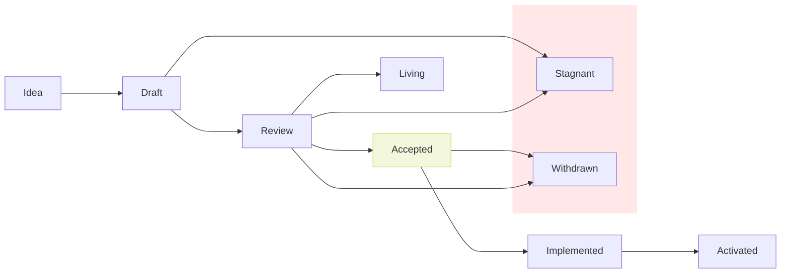

## What is a Proposal?

A proposal is a design document describing a new feature for Solana or its
processes or environment. The proposal should document the rationale for the
feature and enough documentation to understand the implementation.

## Rationale

A proposal is intended to be reviewed by core engineering and community members
keeping in mind security concerns, tradeoffs, and backwards compatibility.
Having a proposal process helps identify design issues early, alert the
community on a change, helps scale newer contributors on the architecture, and
acts as a historical record of the design decisions that have gone into Solana.
For implementors, the proposal is a blueprint for the feature and helps track
the development of a feature.

## When you need to follow this process

You need to follow this process if you intend to make "substantial" changes to
the Validator, RPC, consensus, or a change to the proposal process itself. What
constitutes a "substantial" change is evolving based on community norms and
varies depending on what part of the ecosystem you are proposing to change, but
may include the following:

- A change in format of a RPC API method
- Networking interface changes between validators
- Compute requirement changes on the runtime

Some changes do not require a proposal:

- Rephrasing, reorganizing, refactoring, or otherwise "changing shape does not
change meaning".
- Additions that strictly improve objective, numerical quality criteria
(warning removal, speedup, better platform coverage, more parallelism, trap
more errors, etc.)

## Proposal Types

There are two types of proposals:

- A **Standard** Proposal describes any change that affects most or all Solana
implementations, such as a change to the network protocol, consensus, proposed
application standards/conventions, block or transaction validity, or any change
or addition that affects the interoperability of applications using Solana.
Standard proposals can be broken down into the following categories:

  - **Core**: Anything that affects consensus or substantial changes to the
validator.
  - **Networking**: Changes or substantial improvements to network protocol
specifications.
  - **Interfaces**: Breaking changes around the client JSON RPC API
specifications and standards.

- A **Meta** Proposal describes a process surrounding Solana or proposes a
change to (or an event in) a process. Process Proposals are like Standard
Proposals but apply to areas other than the Solana protocol itself. They may
propose an implementation, but not to Solana's codebase; they often require
community consensus and users are typically not free to ignore them. Examples
include procedures, guidelines, changes to the decision-making process, and
changes to the tools or environment used in Solana development. Any meta-SIMD is
also considered a Process Proposals.

## Proposal Lifecycle

The stages in a lifecycle of a proposal are as follows:

- Idea
- Draft
- Review
- Accepted
- Living
- Stagnant
- Withdrawn
- Implemented
- Activated

### Idea

At the idea stage, parties involved in the proposal are you -- the champion or
proposal author -- the reviewers, and the Solana Core Contributors.

Before you begin writing a formal proposal, you should vet your idea. Ask the
Solana core community first if an idea is original to avoid wasting time on
something that will be rejected based on prior research. Be sure to post your
ideas to the 
[SIMD ideas discussion page](https://github.com/solana-foundation/solana-improvement-documents/discussions/categories/ideas)
and gather feedback before making your formal Proposal

### Draft

To begin drafting the proposal, do the following:

- Fork the proposal repository
- Copy `XXXX-template.md` to `proposals/XXXX-my-feature.md` (where "my-feature"
is descriptive)
- Fill in the proposal. Put care into the details: proposals that do not
present convincing motivation, demonstrate lack of understanding of the
design's impact, or are disingenuous about the drawbacks or alternatives tend
to be poorly received. Low quality proposals with limited engagement will be 
closed by SIMD repository maintainers. Proposal titles should be concise and
descriptive.
- Submit a pull request.
- Now that your proposal has an open pull request, use the issue number of the
PR to update the `XXXX-` prefix to the number.

### Review

During review, the owner of the proposal is in charge of gathering and
integrating feedback. The most relevant core contributors to the proposal
should be included in the review process. Review will take place completely
through Github so that all comments are collected and documented. Once
consensus is met by the core contributors, the proposal can either be accepted
or withdrawn. This step is typically taken when enough tradeoffs have been
considered for the core contributors to make a decision. It is not necessary
for all participants to reach consensus. However, there should not be a strong
consensus against the proposal outside of the core contributors.

### Accepted

Some accepted proposals represent vital features that can be implemented right
away. Other accepted proposals can wait until some arbitrary core contributor
feels like doing the work. Every accepted proposal should have an associated
tracking issue in the Solana repository. If the implementation requires the
feature to be activated using the feature activation program, a feature-gate
issue for tracking across clusters should also be created. While it is not
*necessary* for the proposal author to also write the implementation, it is by
far the most effective way to see a proposal through to completion: authors
should not expect that other project developers will take on responsibility for
implementing their accepted feature.

### Implemented

When all relevant teams have completed development of the SIMD's feature, the 
SIMD is "Implemented".

### Activated

A proposal will have the status Activated once it has been implemented,
tested, and finally activated on mainnet beta. 

### Living

A special status for SIMDs that are designed to be continually updated and not
reach a state of finality. This includes most notably SIMD-1. This status must
undergo extra scrutiny and review when updating the status from review to
living.

### Stagnant

If a proposal reaches 6 months without activity, the proposal will be
marked as stale to be closed. A new proposal can be opened if the proposal is
closed and has a chance of reaching consensus.

### Withdrawn

The author has withdrawn the proposal. This state has finality and can no
longer be resurrected. If the idea is pursued at a later date it is considered
a new proposal.

