## Summary

### general idea

- use asic-resistant time-lock encryption
- use proof-of-work client puzzle for spam mitigation even to hide the fee
  payer
- make transaction expire very soon for minimal additional latency of the
  time-lock decryption
- (future) spoof ip source address to avoid fingerprinting with one-shot
  one-sided udp packet

### terminology

scrambling = time-lock encrypting
descrambling = time-lock decrypting

### pros

- stricter censorship resistance than bps.
- latency minimization incentive is formed and ledger is timestamped for
  later inspection
  - should reduce spamming in the first place
- (future) can generate unbiased random generator

### cons

- artificial latency
- complicated
- somewhat easier dos (hopefully not too easy) with garbage (mitigated by
  client puzzles)
- tps scalability now depends on validator count
- reliance on ntp via wall-clock time-stamp both on tx and ledger entries.

### processing flow of a scrambled transaction

1. user pre-calculates a valid tuple for (de)scrambling: `(scramble_seed,
   descramble_key = recursive-randomx(scramble_seed))`.
2. user measures network latency to the leader
3. user creates and signs a transaction with version=1 (new assigned version)
   also sets tx's block inclusion `max_age` as `end-to-end latency + 20ms`.
4. user encrypts the transaction (aes-128-gcm with `descramble_key`)
5. user attaches the `scramble_seed` and the pow client puzzle to the
   scrambled transaction
6. user submits the scrambled tx to leader
7. the tx is propagated via turbine
8. the tx is descrambled by a certain validator assigned by consistent
   hashing as part of new distributed descrambling stage.
9. validator submits a vote tx with the descrambled key is attached
10. as soon as all descrambled keys are included in child blocks, the parent
    block is scheduled and replayed.

### protocol changes

- banking
  - becomes bankless
  - no practical buffering
- turbine
  - timestamp is added to entries
  - new ledger entry verification: shreds' timestamp comparison against
    received time on socket (must be within sum(deterministic turbine path
    network delay))
  - and shred timestamp to be monotonically-increasing.
  - needs to shred buffered entries more often
- vote transaction
  - additional flag whether the voter thinks the slot was censorship resistant
    or not.
  - additional payload for solved decryption keys (`(Slot,
    Vec<Result<Aes128Key,()>>)`).
- replay stage
  - deterministically reorders transactions by priority fee batched at 50ms
    intervals of entries' timestamp before executing.
  - transactions in the block aren't guaranteed to be executed anymore;
    - could be revealed the tx has expired according to the timestamp of its
      ledger entry position.
    - could be overflow from the fixed-size scheduling queue
- clients
  - new transaction format
  - additional steps: time-lock encrypting, pow client puzzle solving,
    precise network latency measuring

### scrambling

- scrambling is optional. ie. older transaction is supported as before.
- uses recursive randomx to derive private key from plaintext seed attached
  to the tx
  - randomx is a hash function and asic & fpga resistant.
- also equix with difficulty is attached to the tx for spam prevention
  - verification is around 50us per core.
  - should be able to do line-rate filtering.
- padded to `1_232 bytes` (= `PACKET_DATA_SIZE`) to avoid finger printing.

### latency and safety parameters

- scrambled tx expires in **20ms**
  - chosen to be enough for minimal buffering + jitter of one-way network
    latency.
  - so precise time-stamp with subsecond gratuity is attached to the tx
    - the timestamp is scrambled to encourage fifo at banking and avoid
      fingerprinting via deduced network latency.
  - oracle is needed for bad validator with intentionally large latency.
- descrambling is adjusted to take 100ms with modern machine
  - this is **5 times** of tx expiration (20ms).
  - given 2.5 ghz cpu as baseline, 12.5 ghz cpu should be impossible for
    some time?

#### Latency of Average Scrambled Transaction

```mermaid
gantt
    dateFormat SSS
    axisFormat +%S.%Ls
    section tx liveness
    can be sequenced before expiration  :200, 20ms
    section (A) normal
    tx travels the globe to tpu   :a1, 000, 200ms
    tx is sequenced          :milestone, after a1, 5ms
    shred propagation               :a2, after a1, 200ms
    distributed descrambling          :a33, after a2, 200ms
    descramble key prop. (as vote tx)          :a3, after a33, 200ms
    replay                :a4, after a3, 400ms
    replay vote prop.         :a5, after a4, 200ms
    replay is optimistically confirmed :milestone, after a5, 5ms
    section User's view
    tx execution confirmation :milestone, after a5, 5ms
    section (B) MEV
    (tx expires) :milestone, 220, 0ms
    ideally-accelerated descrambling (T_d_best): ai, after a1, 20ms
    reorder/censor txes :milestone, mev, after ai, 5ms
    shred propagation               :mev2, after mev, 200ms
    tx is ignored due to being expired: milestone, after mev2, 5ms
```

### cooperative distributed descrambling

- this is needed because individual node can't descramble all txes: 100ms *
  20000 tx/block = 5000s/block >> 400ms
- all of non-delinquent validators are shuffled and split into 3 groups of
  the same size according to recent parent block
- each group independently solves all scrambled txes assigned with consistent
  hashing
- note that this work balancing should be fully deterministic.
- so, 2000 (current mb node count) / 3 = 666 => 20000 / 666 = 30 descrambling
  / block / node.
- 128/8 * 30 => 480 bytes are increased for each vote transaction.
- liveness isn't strictly stake-weighted here but i'd argue turbine is similar in
  that regard, right?

### edge cases

- user submits complete garbage as tx
  - => simply discarded before including into block
- user submits garbage data with correct pow client puzzle
  - => marked as garbage after distributed descrambling, the garbage will
    remain in ledger though
- cluster fails to descramble all scrambled transactions within slot=4
  - => mark the fork as dead as a whole
- valid scrambled transaction is marked as garbage at distributed descrambling stage
  - => will be slashed
- descrambled transaction is identical to one of already executed transaction
  - => simply ignored
- shred is arrived late via turbine or repaired.
  - => vote normally but with `censorship_resistant={No,Unknown}` hint respectively.
- assigned validator misses to submit `descrambe_keys` on time.
  - => staking reward is reduced (not slashing)
- less than 2/3 node votes on `censorship_resistant=Yes`
  - => mark the fork as dead as a whole
- transaction's timestamp is revealed to be too old compared to ledger entry
  timestamp
  - => won't be executed. fee is paid.

### future work

- scramble vote transaction as well
- relay service to avoid ip source address fingerprinting
- unbiased random
- address tragedy of commons among staked validators.

## Motivation

## Alternatives Considered

## New Terminology

## Detailed Design

## Impact

## Security Considerations

## Drawbacks *(Optional)*
