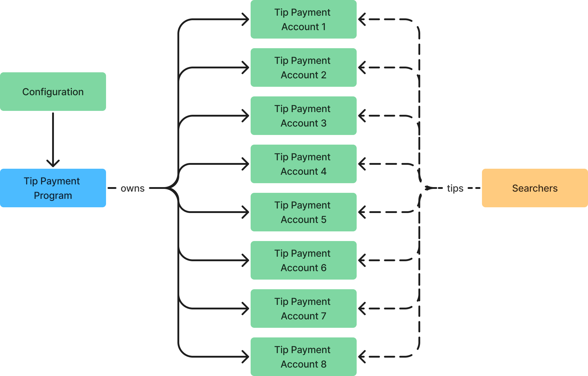

## Summary

I propose the addition of a mechanism that allows sending tips in SOL to the current leader through a built-in program.
It's important that this is a built-in program as opposed to directly tipping the leader to solve for potential issues with Solana's access lists and a rotating leader. 

## Motivation

As of the time of writing, 50% of the network is running Jito-Solana and processing tips payments through the tip payment program. 
In between slots 233,280,000 (December 1, 2023) and 241,629,832 (January 13, 2024), more than 50,000 SOL has been tipped through this program [[source](https://docs.google.com/spreadsheets/d/1fhGxUKYDefV_fgpGwqbEQdgZog_Q8e_J0pZHgDiRj70/edit?usp=sharing)].
Given the large increase in tips happening out of protocol, I believe this mechanism should be brought in-protocol.

### The Tip Payment Program

Note: This section is an aside on how Jito's Tip Payment program works. 
Skip ahead if you don't care, but I think it sets an important context as moving related functionality in protocol given 50% of the network by stake is running the Jito-Solana validator client.

SOL tips in the Jito-Solana validator client are handled by the tip payment program.
The tip payment program is an out-of-consensus runtime program that's tightly integrated with the Jito-Solana validator client.



#### Motivation Behind the Tip Payment Program
This program was written for several reasons:
- 100% of the tips go to the validator's address of choosing instead of 50% being burned.
- It allows for dynamic tipping using CPIs.
- Addresses challenges with Solana's transaction access lists.
  - If a searcher sends a transaction, it has the potential to land on the current and next N leaders (until their blockhash expires).
  - If a searcher wants to send a tip to the validator without the tip payment program, they would need to sign their transactions N different ways.
  - This program was designed such that the tip addresses stay the same and the "owner" of the tips in the program changes.
- Tips are only paid if the transaction successfully executes, as opposed to priority fees which get paid independent of transaction success or not.

#### How does the tip payment program work?
- The tip program consists of eight tip accounts that searchers can transfer SOL to. 
- These transfers can be as top-level instructions or CPIs using the `Transfer` system program instruction. 
- Jito Labs' Block Engine (and likely future block builders on Solana) will simulate transactions and attempt to maximize the SOL transferred to these accounts.
- There is also an associated configuration that contains information like the block_builder address, the block_builder_commission, and a tip_receiver address.
  - These can be ignored for this proposal.
- The tip receiver address is a place where the Solana tips are transferred to when an instruction is called to change the tip receiver.

The following is the order of operations on how this program is used inside a Jito-Solana validator.
1. On the first bundle received for a given slot, the validator ensures the tip payment program tip receiver is configured correctly.
   2. If not, it will call the change tip receiver instruction, which transfers any SOL in the tip accounts to the currently configured tip reciver before changing it.
3. The validator will execute the bundles and tips accumulate in the eight tip accounts.

### Shortcomings of the Compute Budget Program
As mentioned above, there are a few shortcomings of the Compute Budget program.
- The current compute budget program for specifying priority fees burns 50%. This is not incentive compatible for the leaders, 100% should go to the leader.
  - This will be fixed in SIMD-0096.
- The current compute budget program does not allow for dynamic tipping.
  - Dynamic tipping is defined as tipping in the runtime through a CPI and not a top-level instruction.
  - The compute budget program is actually a runtime modifier and not a program one can call into in the runtime.
    - This means that any compute budget instructions must be defined as top-level instructions.
    - Top-level instructions are statically defined on transaction creation.
  - When searchers are tipping in arbitrage and MEV-related transactions, they typically tip a percentage of profit as determined in the runtime.
    - This is helpful as state on-chain likely changes in between their simulation (arbitrage routing) and execution.
      - If searchers have static tips in their transactions, they may end up paying more than their profit.
      - Most searchers have balance checks to ensure their trade was profitable. If they end up tipping too much, their entire transaction reverts.
- The tip payment program also allows validators to dynamically route where tips go. 
  - This allows validators to route tips to themselves or accounts owned by other programs.
  - The best example of the other program is the Jito tip distribution program, which is responsible for routing tips to validators based on a custom commission and all stakers pro rata.

### Shortcomings of the Tip Payment Program
While this program has allowed us to prove out dynamic tips, there are several issues with this mechanism:
- Significant fees for the Solana network are captured out-of-band. It's best for the network that these are moved into the protocol.
- There are eight tip accounts, and it's up to searchers to intelligently load balance across tip accounts.
  - If incorrectly load balanced, it decreases the parallelism in the runtime.

## New Terminology

None

## Detailed Design

There are a few changes that need to happen to the protocol to re-implement the tip payment program in consensus.

### Receiving Tips In The Runtime

### Tip Program

I suggest a tip program as a Solana Native Program with the following instructions and state. 
The TipConfigurationState can either be stored in a validator's VoteState.

```rs
struct TipConfigurationState {
  tip_receiver: Pubkey,
  last_epoch_update: u64,
  new_tip_receiver: Pubkey,
}

enum TipInstruction {
    /// Sends lamports to the leader
    /// # Account references
    ///   0. `[WRITE, SIGNER]` Funding account
    TipLeader { lamports: u64 },

    /// Allows a leader to change their tip receiver.
    /// This instruction enqueues a tip receiver change to happen on the next epoch boundary.
    /// # Account references
    ///   0. `[READ]` The new tip receiver account
    ///   1. `[WRITE, SIGNER]` The leader changing their tip erceiver
    ChangeTipReceiver,
}
```

For transactions that would like to tip the leader, they can either call TipInstruction::TipLeader as a top level instruction
or call into this method in a CPI. Inside the CPI, there is an atomic u64 that increments a variable based on the lamports supplied
in the instruction and subtracts the lamports from the signer's account.

At the end of the slot when a bank is frozen, there is a method that runs, similar to the incinerator, which transfers any accumulated
lamports in the runtime variable into the configured tip_receiver.

The TipInstruction::ChangeTipReceiver instruction allows a validator to change their configured tip receiver. 
Any changes are delayed until an epoch boundary. Furthermore, the tip receiver can only be changed in the first 50% of the epoch
to avoid any last minute changes immediately before the epoch boundary.

## Impact
Tips happen in consensus.

## Alternatives Considered
Pro rata tip distribution to stakers and validators could happen on the epoch boundary and be controlled by another variable. 
However, the epoch boundaries are already very tricky and slow.

## Security Considerations
TODO

### Misappropriation of Tips
Without the epoch rollover constraint on the tip receiver, validators would be able to sandwich transactions that contain large tips,
potentially stealing or misappropriating tips.

## Drawbacks
TODO

## Backwards Compatibility
This will not be backwards compatible and will need to be adopted by all validator clients on the network, gated by a feature flag.