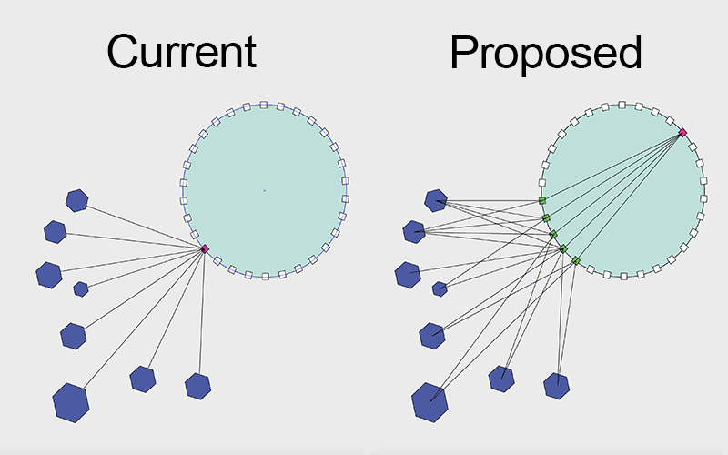

## Summary

This proposal introduces a new load balancing mechanism for the Solana network, namely Prismatic Load Balancing. 
Currently, a single leader is elected to receive all transaction load to its TPU port which creates congestion when 
the leader is overwhelmed with a large amount of network packets. With this proposal we introduce a new design where
leaders receive transaction load from multiple active validators deterministically instead of receiving from outside the
network. While Gulf Stream allows transactions to be sent to any validator to be streamed to the current leader,
it cannot be used as a reliable load balancing mechanism.

## Illustration

## Motivation

We believe the leader's network stack will always become a bottleneck as the network grows regardless of optimizations
on hardware and software. It is similar to the single server web 2.0 era where even an unsofisticated DDoS attack
was able to take down a website. Characteristics of Proof of History opens up an unconventional design space for 
Solana transaction ingestion. Our design aims to leverage the unique properties of PoH to create a deterministic 
load balancing mechanism where load balancing validator nodes (LBVN) are scaled with the active validator count.

## Alternatives Considered

None

## New Terminology

LBVN: Load Balancing Validator Node

MMPP: Micro Mempool Packet

## Detailed Design

We choose a set of validators to be load balancing validators (LBVN) where each validator is responsible for
receiving transactions from all external clients outside the network. LVBNs are selected deterministically
from the active validator set while ensuring that the set does not include any validator that can process the transaction
themselves. The deterministic selection algorithm is described below. 

### LBVN Selection Algorithm
1- Identify the current leader position in the leader schedule

2- Walk the leader schedule for 150 + (s) slots ahead while collecting all unique validator identities to the set 'bV',
where 's' is a safety margin to account for missed slots.

3- Continue walking leader schedule to collect unique validator identities, ignoring leader and identities found in 'bV
until the set 'bV' reaches a size of 'n', where 'n' is sqrt of active validator count.

### Transaction ingestion flow

RPCs use the LBVN set to send transactions to the network with consistent hash-based distribution mechanism using 
transaction signature. LBVN nodes are responsible for forwarding transactions to the leader node. To incentivize 
the honest work of LBVNs, we introduce a new reward mechanism where part of the block reward goes to the LBVN set based
on the origin LBVN of the transaction in the block. LBVN nodes can have several extra duties apart from simply forwarding
to help leader's scheduler:

* TX validation
* TX deduplication
* TX reordering based on priority fees in small batches (MMPP), where leader will map-reduce incoming MMPPs to generate
a large mini mempool for block production.

Validators should close their TPU port to external clients and only accept transactions from LBVN nodes when
they're selected as leader. Validators can also keep a separate long-lived connections to other validators to utilize 
for LBVN -> Leader communication.

## Impact

Distributing the leader's heavy network duties among multiple validators may increase network's resilliency. 

## Security Considerations

LBVN set can act maliciously by censoring transactions to consume themselves on a retry. We try to mitigate this by
not including validators that are close to the leader in the leader schedule however long range missing slots can still
cause a validator to conceal transaction to use for their own consumption.
