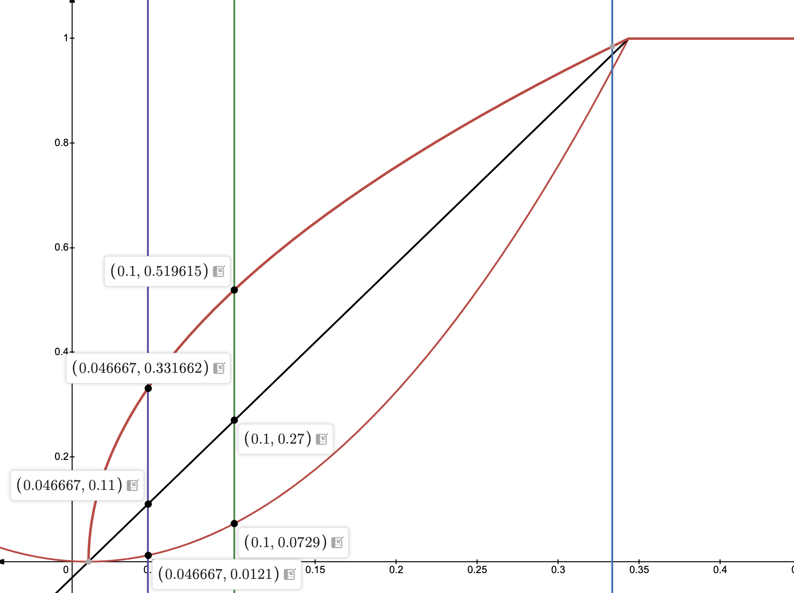

## Summary

This proposal covers the implementation of slashing in the Solana protocol.
It builds upon the work of SIMD-0204 to impose penalties on detected violations.
It covers three different topics:

- Function to derive the amount of stake to slash for each offense
- Runtime changes to consume the slashing program's results and subtract
  stake from delegations at epoch boundary
- Future work to shore up faults in the proposed slashing mechanism

We propose one possible method for punishing slashable infractions via burning
delegated stake. This is by no means a suggestion that this is the only way to
deter slashable behavior. We outline alternatives in later sections.
This proposal is intended to inform and spark discussion and subject to change
via community feedback.

## Motivation

Slashing in dPoS protocols provides economic discencentives for malicious
activity, while creating incentives for stakers to distribute stake amongst
reputable validators. Additionally it provides another metric for validators to
distinguish themselves and accrue reputation, by detecting bad network
participants and not incurring slashing violations themselves.

While not strictly necessary for safety and liveness guarentees, consensus
relies on slashing to make guarentees about Optimistic Confirmation. With the
current parameters, we guarentee an optimistically confirmed block will always
be finalized unless $4.\overline{66}$% of the stake is eligible to be slashed.
These guarentees imply some form of slashing detection should be implemented.

## New Terminology

**Slashing**:

The process by which malicious behavior is verified and recorded on chain, and
a portion of delegated stake associated with the offending validators
is burned.

**NC Line**:

The Nakamoto Coefficient line. The stake of the smallest validator
that comprises the superminority.

More formally, given a cluster of validators $V$ with stake function $stake$

Let $SM$ be the smallest partition of $V$ such that

$$\frac{\sum\limits_{v \in SM} stake(v)}{\sum\limits_{v\in V}stake(v)} > \frac{1}{3}$$

Then

$$NC_{line} = \min\limits_{v\in SM}stake(v)$$

### Feature flags

`enable_slashing`, requires governance vote to activate:

- `s1ashYt4AFjzwM7V9QBcDS21eEcy8bGHbxp47XGyo3T`

### Prerequisites

Leader schedule migration: SIMD-0180

Partitioned epoch rewards: SIMD-0015

Slashable event verification: SIMD-0204

---

## Detailed Design

This section describes the function used to determine how much of each delegation
is slashed per vote account. The function outlined here is motivated by the
following principles:

1) Do not slash for minor operator errors:\
  Misconfigurations from low stake validators that do not disrupt consensus should
  not be slashed if it can be avoided.

2) Design the slash function around the byzantine fault tolerance of the Solana
  Consensus protocol: $\frac{1}{3}$.
  This means if $> \frac{1}{3}$ of stake is engaging in malicious activity we expect
  that all offending stake should be slashed.

3) Encourage decentralization and performance principles

The inputs to this function are the following for each vote account $v$ in the
validator set $V$:

- $stake(v)$ is the max delegated stake of vote account $v$ during the
  reporting period.
- $num(t, v)$ is the number of violations of type $t$ that $v$ incurred in this
  reporting period.
- $weight(t)$ is the relative weight of each violation. Voting violations have
  this set to 1, as the extra network load is directly correlated to the stake
  of the offender. For duplicate block violations we set this to 10, as duplicate
  blocks cause a lot more network resources to resolve, independent of the offenders
  stake.
- $TS$ the total active stake of the cluster during the reporting period. We
  aggregate the maximum stake a validator had active at any point in this period.

We determine the stake weighted slashable offenses for $v$ based on its max
stake in the reporting period:

$$S(v) = stake(v)\sum_{t\in T}num(t, v)weight(t)$$

From this we calculate the Total Slashable Stake (TSS) in this reporting period:

$$TSS = \sum_{v\in V} S(v)$$

We then compute the fraction to slash for each vote account:

$$slash(v) = \left(\frac{3\max(0, TSS - NC_{line})}{TS}\right)^2$$

Let $balance(d, v)$ be the balance of the delegation $d$ of vote account $v$.
We adjust this on epoch boundary by burning the remaining amount:

$$balance(d, v) = \max(balance(d, v)(1 - slash(v)), 0)$$

$slash(v)$ has the property that if $TSS < NC_{line}$ then no stake is slashed.
This has a secondary effect of encouraging operators and stakers of the superminority
to break up stake in order to lower the $NC_{line}$ as the network matures. Additionally
if $\frac{1}{3}$ of stake has participated in slashable offenses in this period
we achieve full slashing for all offending delegations.

We propose a quadratic function that has a slow rate of growth.
For comparison here is a graph showing a linear and radical curve as well.
From top to bottom:

- $slash(v) = \sqrt{\dfrac{3\max(0, TSS - NC_{line})}{TS}}$

- $slash(v) = \dfrac{3\max(0, TSS - NC_{line})}{TS}$

- $slash(v) = \left(\dfrac{3\max(0, TSS - NC_{line})}{TS}\right)^2$

We plot these functions with $NC_{line} = 1$% of stake, $\dfrac{TSS}{TS}$ plotted
on the X axis and $slash(v)$ on the Y axis (capped at 1). Our proposed curve is
at the bottom in red.



The $slash(v)$ function suggested in this proposal has a relatively slow rate of
growth, slashing only $1.2$% of offenders stake when $4.\overline{66}$% stake is
in violation and $7.3$% when $10$% of stake is in violation.

## Alternatives Considered

The slashing function proposed in this protocol is only one of many that could
be applicable to the motivations of the solana protocol. This section outlines
alternative ideas.

Slashing delegated stake requires that stakers are informed and choose reputable
validators to stake with. Even the most diligent stakers have a chance to be slashed
if their validator decides to turn malicious. An alternative is to require validators
to self stake some percentage of delegated stake. This ensures that validators have
skin in the game and could deter future malicious activity.

A further measure is to require self stake and only slash self stake, automatically
destaking delegators who staked with a slashed validator. This offers some protections
to stakers who can then restake with a different validator only missing out on a
couple epochs worth of rewards.

This scheme can also be modified in other ways:

- Burn rewards, do not slash any stake
- Do not burn rewards or slash any stake, simply deactivate all delegations

Any scheme involving deactivations is subject to stake cooldown limits, see
[Security Considerations](#security-considerations)

Another alternative is to only perform manual slashing. A regular governance
protocol can provide the social layer tools to identify and slash misbehaviors.
This approach incurs a large real world communication overhead
but allows for fine grained consideration of each slashing offense.

Finally the current proposal is for slashed funds to be burned. An alternative
is to redistribute these funds in protocol:

- Redistribute to delegators of honest validators
- Redistribute to a protocol insurance fund

An insurance fund has many possibilities, for example stakers could engage in a
bond with the fund to receive proportional protections in case their stake gets
slashed. However this fund does not have to operate at a protocol level, which
incurs a lot of governance and process overhead. Instead stake pool operators
can offer their own insurance funds using generated profit.

Some might consider distributing part of the slashed funds to the reporter to
encourage reporting. In fact some other layer 1 protocols do have some sort of
"reporting fee". The concern with this distribution is that any competent validator
will frontrun the proof transaction to the slashing program and claim the fee for
themselves. The hope is that the burning of stake is enough of an incentive for
reporters and validators to ensure that the proof gets recorded on chain.

### Epoch boundary runtime processing

At every epoch boundary we collect all PDAs of the Slashing program (see SIMD-0204
for details of these accounts), filtering on the epoch field to only consider
reports that were created in the current epoch. We know that this report must be
for a violation that occured in this epoch or in the previous epoch.

After collation we translate `node_pubkey`s into vote accounts (SIMD-0180) for
`DuplicateBlock` violations and aggregate a map for each vote account that
created a violation, to be extended when other types of violations are added:

```rust
  Vec<Pubkey /* Vote Account */, (usize /* duplicate block violations */, ..))>
```

For all eligble vote accounts in $V$ and violation types $T$ we calculate the weighted
slashable stake $S(v)$. We also calculate the total weighted slashable stake $TSS$.
Finally for each vote account $v$, we calculate $slash(v)$ and the resulting balance
of each delegation $balance(d, v)$.

As part of the rewards calculation phase described in SIMD-0118, we adjust the
rewards $r$ that each delegation $d$ of vote account $v$ would receive as
$r' = \max(0, r(1 - slash(v)))$.

Additionally we add a new rewards type "Slashing", which tracks the amount of
each existing stake delegation that is to be burned.

During PER distribution, we burn the required stake for each delegation to match
this new balance, and credit the rewards $r'$. This burn is performed *before*
any stake is deactivated from the delegation.

Through this methodolgy we are able to leverage the performance of PER with minimal
protocol changes. In particular the `EpochRewards` sysvar does not need to be modified,
only the rewards calculation and distribution.
On boot from snapshot we are able to recalculate the slashing function using the
Slashing Program's PDAs. Since `CloseProofReport` has a 3 epoch buffer, we are
guarenteed that this matches the calculation performed at the epoch boundary.

Additionally the stake program must take slashed stake into account as part of
the warmup/cooldown rate. Stake that is slashed is considered instantly deactivated,
so should be subject to the cluster quota. In these cases we prioritized slashed
stake over stake undergoing voluntariy deactivation. See
[Security Considerations](#security-considerations) for the motivation.

### Shortcomings and necessary future work

This proposal takes steps towards slashing malicious network participants but there
are still faults present that allows participants to engage in slashable activities
without repurcussions.

#### Stake deactivation

There are parts of the solana protocol that calculate stake in advance which can
result in deactivated stake and even withdrawn stake having influence in the protocol.
This leads to difficulty when penalizing validators that perform slashable actions.

For example since the leader schedule is generated in advance, leaders can submit
duplicate blocks without having any stake at risk if they deactivate and withdraw
their stake in time. Similarly fork choice uses epoch stakes which correspond to
the previous epoch's calculation. This allows a voter to deactivate their stake
in a previous epoch, and withdraw their stake at the beginning of the current
epoch. At this point they are free to commit voting violations without the risk
of being slashed.

To address this, we should have an additional cooldown period in which the stake
is still eligble to be slashed, but does not contribute to protocol stake weight.
This can create a poor user experience as users must now wait an extra 2 epochs
in order to withdraw stake. To remedy this we can consider reducing the size of
epochs. Further discussion towards a solution for these cases will happen in a
future SIMD.

#### Post report desperados

Since stakes are calculated in advance, this means that slashed stake also
requires an additional epoch to be viewed. If a validator misbehaves in epoch `E`
and is slashed as a result, in epoch `E + 1` their stake in consensus does not
reflect this. It is not until epoch `E + 2` where the validator's stake is updated
to reflect the amount that was burned.

This means that a validator that is due to be fully slashed has at least one
epoch where they are still a part of consensus. Since there is nothing left at
risk for this validator, they might be motivated to engage in a desperado, committing
as many slashable violations as possible during this period without any consequence.

It is not yet possible to perform any instant slashes as stake movement has to be
fully observed by the cluster before used in consensus, however we might consider
shortening epoch lengths to minimize real world time for this sort of behavior.

---
Even with the existence of these shortcomings, slashing is better than what exists
today where all malicious behavior goes unpunished.

## Impact

Delegations can be partially or fully slashed due to malicious operations.

Stake pools and LST solutions must be aware that the underlying validators can
be slashed. This could lead to a drastic token repricing or in the worst case
a depeg if the market loses confidence in the validator.

## Security Considerations

Slashing relies on proof verification through the Slashing Program. Bugs in this
program could result in false positives, allowing honest validators to be slashed.
This creates a new vulnerability surface in the Solana protocol. The slashing program
should be heavily audited before the `enable_slashing` feature is activated.

Optimistic Confirmation (OC) is the Solana protocol's approach to soft confirmation.
It ensures that a block which reaches supermajority quorum is eventually finalized
unless $4.\overline{66}$% of stake is slashed. To ensure this condition for OC blocks
near epoch boundaries, we additionally stipulate a stake movement limit - no more
than 18% of total stake can change at any given epoch boundary. This is currently
implemented in the stake program as a 9% limit of new stake activations plus a 9%
limit of stake deactivations.

Regardless of which method of slashing we use, there is some percentage of stake
that is either burned or deactivated on epoch boundary. In epochs with high malicious
activity, the amount of stake slashed, deactivated, and activated could be
more than 18%. In these scenarios we prioritize slashing, and any leftover quota
is assigned to normal stake movement operations.

It is important that slashing is counted as part of this quota, as otherwise an
OC block could be rolled back with a smaller percentage of slashing, (e.g. 1%
slashing, 18% stake movement). In rare scenarios this could create a poor user experience
for stakers wishing to unstake - they could be forced to wait an additional epoch
because there is no quota left.

Yet if there is more than $4.\overline{66}$% of stake to be slashed we can relax
the 18% quota. This could result in an OC block being rolled back, but at least
$4.\overline{66}$% are being slashed, meaning our guarentee is still maintained.

However for liveness, if there is more than 24% stake movement at the epoch boundary,
there is a possibility of a liveness failure. This means the quota can never exceed
24%.

This means in extreme cases where more than 24% of the stake must be slashed we
cannot safely perform all slashes in one epoch, so a portion must be delayed to
the next epoch. But allowing these malicious nodes to continue for another epoch
is not ideal, since these nodes are aware that their stake is due to be slashed
they have no incentive to behave properly. They are free to stop participating
in consensus or continue engaging in slashable activities.
Although such a situation should be quite rare, it is worth noting.

Finally the goal of the Solana consensus protocol is to mainatain liveness even
under $\frac{1}{3}$ malicious stake. Although in these cases malicious stake can
continue to perform slashable offenses, we should expect no impact on liveness.

## Drawbacks

As mentioned above slashing adds additional risk to staking, which could hurt
or discourage stakers. It could be argued that this risk is acceptable in order
to ensure that malicious activity is punished, but it ultimately comes down to
framing and the success of the slashing program. Bugs in the early versions of
the slashing program could result in excessive slashes leading to stakers leaving
the protocol.

A argument for slashing is that without it the cost-of-corruption is theoretically
negligble, suscepting Solana to $p+\epsilon$ attacks. In theory slashing
will increase the cost-of-corruption to $\frac{1}{3}$ of total stake, however
in practice this might not be true. [\[1\]](#notes) [\[2\]](#notes).

In practice real world validators have to consider external factors like social
reputation and legal risk, making out of protocol bribes not so easy to analyze.
Coordinating a timely cluster restart is already a huge coordination overhead,
colluding $\frac{1}{3}$ of stake through backroom bribes seems infeasible.
In practice we see very little intentional malicious activity on mainnet, however
the future is unknown. Even the most basic form of manual slashing allows the protocol
to be prepared in the face of future threats.

## Backwards Compatibility

The feature is not backwards compatible

## Appendix

This section is a preview into other slashing cases planned to be added in follow
up SIMDs. This gives readers an idea of what a complete slashing program could
look like when evaluating this proposal.

### Lockout violations

A lockout violation occurs when a validator votes on two separate forks without
waiting the appropriate amount of time for lockout to expire. The proof of this
violation comprises of 4 parts:

- Two vote transactions each for a different fork
- A slot indicating the greatest common ancestor (GCA) of these two forks
- A proof of ancestry for this slot, which can be verified to concur that these
  votes are for different forks

With this we can validate the expiry of the vote transactions to verify that
lockout was violated. The GCA  slot and proof of ancestry must also be validated
to conclude that these transactions are not for the same fork.

With the new shred format, the merkle root of each FEC set includes the merkle
root of the previous set. This means that one can create a merkle proof showing
that one shred is a descendant of another shred. This tool can be leveraged to
create the ancestry proof. These proofs can be massive so a zk prover circuit
will be used to achieve a fixed size at the cost of increased computation on
behalf of the reporter.


### Switching proof violation

A switching proof violation occurs when a validator votes on two separate forks
without acquiring the necessary stake in order to switch forks. As a simplification
imagine that in order to switch and vote on a different fork we must observe
that 38% of the stake has not voted on our current fork and voted for a competing
fork instead.

Currently voters collect vote transactions from other validators to show that
at least 38% of the cluster has voted on a competing fork apart from our own.
They then hash these transactions and submit the hash along with their switch vote.
Once switching proof slashing is enabled, they must also store these transactions
in a proof format offline for the reporting period.

If a reporter detects that a voter could not have observed the 38%, they post a
challenge to the slashing program. The validator then has a fixed timeframe to
respond to the challenge with the stored proof to show that it observed the 38%
threshold.

The slashing program can then verify the signature and stakes of the vote transactions
from the proof in order to come to a verdict. The challenge should bond a reasonable
amount of SOL to cover the cost for the validator to store the transactions and
respond to the challenge. If the proof is valid, the bond is forfeited and credited
to the validator. If the proof is invalid or the validator does not respond
to the challenge, the validator in violation is recorded for slashing and the bond
is returned to the reporter.

---

More concrete details on these cases will be shared in a future SIMD.

## Notes

\[1\]: A simplified analysis of cost-of-corruption: https://a16zcrypto.com/posts/article/the-cryptoeconomics-of-slashing/#section--8

\[2\]: $p + \epsilon$ attacks: https://blog.ethereum.org/2015/01/28/p-epsilon-attack
