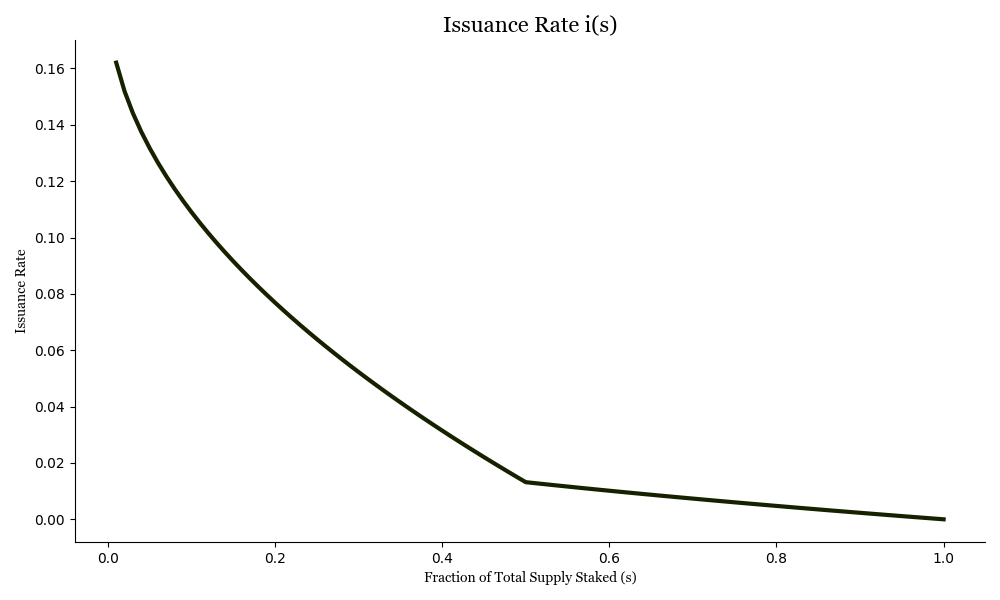

## Summary

SIMD-0228 Introduces a Market-Based emission mechanism based on staking
participation rates. The mechanism is a static curve that reduces the total issuance
rate by a factor of the square root of the staking participation rate.

## Motivation

Solana has historically relied on token emissions to attract stake and guarantee security.
As Solana matures, stakers are increasingly earning SOL from other sources (e.g. MEV).
These developments have resulted in an increasing fraction of the Solana supply staked,
meaning the network is now overpaying security since emissions haven't adjusted to the elevated demand for staking.
According to Blockworks (https://solana.blockworksresearch.com/), in Q4 2024 MEV, as measured by Jito
Tips, was approximately \$430M (2.1M SOL), representing massive quarter-over-
quarter growth. In Q3 Jito Tips were approximately \$86M (562k SOL), Q2 was
approximately \$117M (747k SOL), and Q1 was approximately \$42M (300k SOL).

Given the level of economic activity the network has achieved and the subsequent
revenue earned by stakers from MEV, now is a good time to revisit the network's
emission mechanism and evolve it from a fixed-schedule mechanism to a
programmatic, market-driven mechanism.

The purpose of token emissions in Proof of Stake (PoS) networks is to attract
stakers and validators to secure the network. But issuance should never by higher than needed because  Therefore, the most efficient
amount of token issuance is the lowest rate possible necessary to secure the
network.

Solana's current emission mechanism is a fixed, time-based formula that was
activated on epoch 150, a year after genesis on February 10, 2021. The mechanism
is not aware of network activity, nor does it incorporate that to determine the
emission rate. Simply put, it's "dumb emissions." Given Solana's thriving
economic activity, it makes sense to evolve the network's monetary policy with
"smart emissions."

There are two major implications of Smart Emissions:

Smart Emissions dynamically incentivizes participation when stake drops to
secure the network.
Smart Emissions minimize SOL issuance  to the Minimum Necessary Amount (MNA) to
secure the network.

This is good for the Solana network and network stakers for four reasons:

High inflation can lead to more centralized ownership. To illustrate the point,
imagine a network with an exceedingly high inflation rate of 10,000%. People who
do not stake are diluted and lose ~99% of their network ownership every year to
stakers. The higher the inflation rate, the more network ownership is
concentrated in stakers' hands after compounding for years.

Reducing inflation spurs SOL usage in DeFi, which is ultimately good for the
applications and stimulates new protocol development. Additionally, a high
staking rate can be viewed as unhealthy for new DeFi protocols, since it means
the implied hurdle rate is the inflation cost. Lowering the "risk free"
inflation rate creates stimulative conditions and allows new protocols to grow.

If Smart Emissions function as designed, they will systematically reduce selling
pressure as long as staking participation remains adequate. The inevitable side
effect and primary downside to high token inflation is increased selling
pressure. This is because some stakers in different jurisdictions have taken the
interpretation that staking creates ordinary income, and therefore they must
sell a portion of their staking rewards to pay taxes. This selling is a
significant detriment to the network and does not benefit the network in any
way.

In markets, sometimes perception is as important as reality. While SOL inflation
is technically not cost to the network, others think it is, and that belief
overall has a negative impact on the network. Inflation causes long-term,
continual downward price pressure that negatively distorts the market's price
signal and hinders fair price comparison. To use an analogy from traditional
financial markets, PoS inflation is equivalent to a publicly listed company
doing a small share split every two days.

Historically, issuance curves have remained static due to Bitcoin's immutability
ethos—a "Bitcoin Hangover" so to speak. While immutability suits Bitcoin's
mission to become digital gold, it doesn't map to Solana's mission to
synchronize the world's state at light speed.

In summary, the current Solana emissions schedule is suboptimal given the
current level of activity and fees on the network because it emits more SOL than
is necessary to secure the network. An issuance curve set by diktat is not the
right long-term approach for Solana. Markets are the best mechanism in the world
to determine prices, and therefore, they should be used to determine Solana's
emissions.

## Detailed Design

### The Variables:

- Fraction of total supply staked: $s$
- Issuance Rate $i$
- Validator returns $v(s) = \frac{i}{s} + MEV$
- r is the current inflation rate which is a constant (currently 4.5%) that automatically goes down by 15% every year until it reaches 1.5% where it stops changing.

### New Emission Rate Formula

The issuance rate formula is:

$i(s) = r(1 - \sqrt{s})$

This yields a vote reward rate for validators with good performance of:

$v(s) = \frac{i(s)}{s} = \frac{r(1 - \sqrt{s})}{s}$

## Alternatives Considered

### Alternative Design 1: Pick another fixed rate

A simple alternative would be to adjust the issuance rate to a fixed number, $r$
determined by community inputs. However, this approach presents several risks:
Lack of Market Mechanisms: Setting a fixed rate ignores the dynamics of free
markets and the network's real-time economic conditions:
- **Lack of Market Mechanisms**: Setting a fixed rate ignores the dynamics of free markets and the network's real-time economic conditions
- **Arbitrary Adjustments**: Using another arbitrary number risks undermining the integrity of the system and may lead to decisions that are disconnected from the network's needs
- **Erosion of Trust**: Relying on fixed adjustments could erode trust in the community's decision-making process, especially if future changes seem disconnected from market realities
- **Compromised Consensus Safety**: A fixed issuance rate, especially in uncharted territory, could undermine consensus safety, as it would not be dynamically tied to staking participation or broader network health

### Alternative Design 2: Fix Target Staking Yield

- **Revenue Source**: MEV has become a significant revenue source for stakers.
- **Proposed Change**: One can consider changing the issuance rate by factoring in MEV tips, maintaining the same target yield as the original curve but offsetting it by the 30-day moving average of MEV tips.
- **Formula**: New Issuance Rate (i) = Target Staking Yield − 30-day moving average of MEV tips
- **Market Impact**: MEV tips reflect real revenue for validators and stakers, allowing the system to adjust to market conditions:
  - **Hot Markets**: Higher MEV tips allow for lower emissions.
  - **Cold Markets**: Increased emissions compensate validators, maintaining network security.
- **Inspiration**: This approach is inspired by central bank monetary policy, adjusting inflation based on economic conditions.
- **Key Challenge**: The big challenge with this design is that it incentivizes MEV payments to move out of sight of the tracking mechanism, thereby rendering the design completely ineffective.
- **Important Note**: For an abundance of clarity, we are not proposing any design which requires measuring MEV payments.

## Impact

Implemented thoughtfully, this design could have a major positive economic
impact on the overall health of the Solana economy.

## Security Considerations

Targeting a staking participation rate of 50% ensures sufficient stake for
consensus safety while maintaining the network's security and decentralization.

Below 33%, we potentially risk network safety because a supermajority of all SOL
has explicitly not voted on any given block and this opens the edge case
possibility of long range attacks. It is important to note that these long range
attacks are entirely theoretical and we have not seen one in practice. There are
other mechanisms in Solana to protect against long range attacks.

This proposal is the first in a series of steps to make Solana's consensus more
secure and economics more market driven. The successor to this proposal is
another SIMD that introduces the concept of long-term staking, which seeks to
improve network security. The option to unstake SOL on a relatively short notice
(i.e., a short cool down period) poses a potential risk to networks' stability
and safety, particularly in extreme circumstances where a significant amount of
SOL is unstaked within a brief timeframe. The combination of these two SIMDs
address these concerns while improving network security and economic activity.

