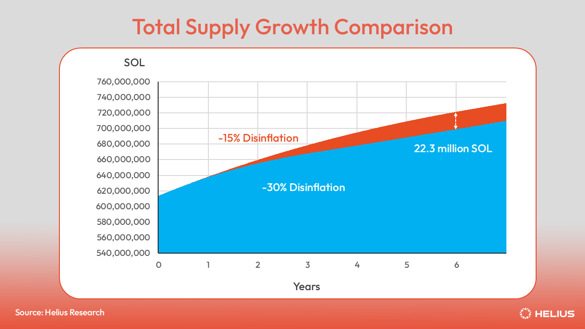
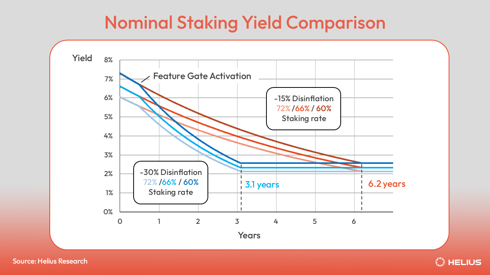

## Summary

This SIMD proposes updating the inflation schedule by increasing the
disinflation rate from -15% to -30%, effectively doubling the pace of
inflation decline.

Our modeling indicates this will have the following effects:

- Reach the terminal inflation rate of 1.5% in 3.1 years (early 2029)
instead of 6.2 years (early 2032)

- Reduce emissions by 22.3 million SOL ($2.9 billion) over six years

- Bring nominal staking yields from the current 6.41% to 5.04% in year
one, 3.48% in year two, and 2.42% in year three.

- Have a muted impact on the number of profitable validators, with 18
validators out of 845 transitioning from profitable/breakeven to
unprofitable in year one, 28 in year two, and 44 in year three.

## New Terminology

This proposal does not introduce any new terminology.

## Motivation

The core motivation for this proposal is to materially reduce Solana’s
emissions schedule. Unlike SIMD-228, doubling the disinflation rate takes a
fundamentally different approach to emissions reduction, with the following
benefits:

**Simplicity**: Doubling the disinflation rate requires modifying a single
parameter, making it the simplest possible protocol change that delivers a
meaningful reduction in inflation. This adjustment is straightforward to
implement and will not consume core developer resources. It carries minimal
risk of introducing bugs or unforeseen edge cases.

Because the adjustment is intuitive, it can be easily communicated to all
stakeholder groups, including retail stakers, non-crypto native institutions,
and regulators, regardless of their technical background.

**Predictability**: Unlike dynamic inflation mechanisms, the effects of doubling
the disinflation rate are predictable and easy to model. This provides strong
certainty around future inflation and emissions.

The adjustment gradually reduces emissions over many years, avoiding abrupt
shocks to the network or the economic system. The original long-term inflation
target (1.5%) remains unchanged; this proposal merely accelerates the path to
that established equilibrium.

**Supply Reduction**: Our modeling indicates that, over the next 6 years, total
supply would be approximately 3.2% lower (a reduction of 22.3 million SOL) than
under the current inflation schedule. At today’s SOL price, this equates to
roughly $2.9 billion in reduced emissions. Excessive emissions create persistent
downward price pressure, distorting market signals and hindering fair price
comparison.

**Plugging the Leaky Bucket**: High token inflation increases sell pressure, as
some stakers, especially in certain jurisdictions, treat staking rewards as
ordinary income and need to sell a portion to cover taxes.
[Max Resnick's analysis][max-resnick-analysis] outlined a 17% "leaky bucket"
tax on inflation (i.e., the gap between ordinary income and the 20% long-term
capital gains rate). Combined with governments, centralized exchanges, and
custody providers taking significant cuts of staking rewards, even small
reductions in issuance can save the network hundreds of millions of dollars
per year.

**DeFi Usage**: High inflation increases the opportunity cost of deploying SOL in
DeFi, discouraging participation in lending, trading, and liquidity provision.
The effect mirrors traditional finance: higher interest rates raise the
risk-free rate and reduce borrowing and spending. In Solana’s case, the
“risk-free rate” is the native staking yield.

**Flexibility**: This adjustment does not preclude the community from adopting more
sophisticated, dynamic, or market-driven emission systems at a later date,
should they be desired.

### Why Double?

Any adjustment to the inflation schedule must be significant enough
to materially reduce emissions, yet moderate enough to avoid introducing shocks
to the system. Doubling the disinflation rate is a straightforward, balanced
way to achieve these goals.

The idea itself is not novel, having been independently proposed multiple times
(e.g., [1][proposal-1], [2][proposal-2], [3][proposal-3], [4][proposal-4]).

## Detailed Design

Three parameters define Solana’s current inflation schedule:

- Initial Inflation Rate: 8%
- Disinflation Rate: -15%
- Long-term Inflation Rate: 1.5%

As of mid-November, the inflation rate stands at 4.18%. Under the current
disinflation schedule of -15% per year, it will take approximately 6.2 years
(early 2032) to reach the terminal rate. Doubling the disinflation rate to -30%
significantly shortens this timeline, bringing the network to its long-term
terminal inflation rate in roughly 3.1 years (early 2029). This assumes a
6-month lag period before any change is activated to account for the governance
process and Alpenglow update. This provides a reasonable timeline that
addresses concerns about inflation, without introducing systemic shock to an
already shrinking validator set.

Yearly comparisons are provided below, with full numbers in
[this sheet][modeling-sheet].

| Period        | Current Disinflation (-15%) | Proposed Disinflation (-30%) |
|---------------|------------------------------|-----------------------------|
| Current       | 4.18%                        | 4.18%                       |
| After 1 year  | 3.55%                        | 3.21%                       |
| After 2 years | 3.01%                        | 2.24%                       |
| After 3 years | 2.55%                        | 1.56%                       |
| After 4 years | 2.16%                        | 1.50%                       |
| After 5 years | 1.84%                        | 1.50%                       |
| After 6 years | 1.56%                        | 1.50%                       |


### Implementation

We can implement the following proposal by adding a new implementation method
to `Inflation` in the [`solana-inflation` crate](https://github.com/anza-xyz/solana-sdk/tree/master/inflation):

```rust
impl Inflation {
    // ...

    pub fn accelerated_taper() -> Self {
        Self {
            initial: DEFAULT_INITIAL,
            terminal: DEFAULT_TERMINAL,
            taper: 0.30, // Double
            foundation: 0.0,
            foundation_term: 0.0,
            __unused: 0.0,
        }
    }
}
```

We would also need to [add a new feature set][agave-feature-set], which would
then be used in [Agave's bank.rs][agave-bank] to overwrite the current
inflation schedule with the latest change, which would look like:

```rust
if new_feature_activations.contains(
    &feature_set::double_disinflation_rate::id(),
) {
    *self.inflation.write().unwrap() = Inflation::accelerated_taper();
    self.fee_rate_governor.burn_percent =
        solana_fee_calculator::DEFAULT_BURN_PERCENT;
    self.rent_collector.rent.burn_percent = 50;
}
```

## Impact

### Reduced Emissions

Doubling the disinflation rate results in an estimated total supply of
699.19 million SOL after six years, 22.3 million SOL lower (3.2%) than under
the current inflation path. At current SOL prices, this is a $2.9 billion
reduction in emissions. Following the implementation of SIMD-0096, the share
of issuance offset by burned transaction base fees is negligible
([see chart][burn-rate-chart]) and has been excluded from this analysis.
Full numbers in [this sheet][modeling-sheet].

| Period                | Current -15% | Proposed -30% |
|-----------------------|--------------|---------------|
| Current (mid Nov 2025) | 613,823,198 | 613,823,198   |
| After 1 year          | 638,226,790  | 637,661,546   |
| After 2 years         | 659,812,163  | 655,389,900   |
| After 3 years         | 678,584,933  | 667,958,800   |
| After 4 years         | 695,015,051  | 678,245,313   |
| After 5 years         | 709,181,881  | 688,610,002   |
| After 6 years         | 721,490,711  | 699,191,341   |

| Period                | Difference (SOL) | Difference (%)   |
|-----------------------|------------------|------------------|
| Current (mid Nov 2025) | 0               | 0%               |
| After 1 year          | 565,243.98       | 0.09%            |
| After 2 years         | 4,422,263.36     | 0.67%            |
| After 3 years         | 10,626,133.08    | 1.6%             |
| After 4 years         | 16,769,737.54    | 2.47%            |
| After 5 years         | 20,571,879.01    | 2.99%            |
| After 6 years         | 22,299,369.53    | 3.2%             |



### Nominal Staking Yields

Nominal staking yields were modeled under three plausible staking
participation scenarios, 60%, 66%, and 72%, which reflect historical staking
ranges ([see chart][staking-rate-chart]). These modeled yields represent the
baseline nominal returns of staking, excluding commissions or additional yield
sources such as MEV and block rewards. They can be considered a worst-case
scenario for staking yield in the event of very low network activity.

At the mid-range assumption of a 66% staking rate (which closely reflects
current conditions), nominal staking yields decline by roughly 0.8% after one
year under a -15% disinflation scenario, and by about 1.4% under a -30%
disinflation scenario. The table and chart below provide full year-over-year
comparisons. Full numbers in [this sheet][modeling-sheet].

| Period                | Current Schedule | Proposed Schedule |
|-----------------------|------------------|-------------------|
|                       | 72% / 66% / 60%  | 72% / 66% / 60%   |
| Current (mid Nov 2025) | 6.41%           | 6.41%             |
| After 1 year          | 5.11% / 5.59%    | 4.61% / 5.04%     |
|                       | / 6.16%          | / 5.56%           |
| After 2 years         | 4.31% / 4.72%    | 3.19% / 3.48%     |
|                       | / 5.20%          | / 3.84%           |
| After 3 years         | 3.65% / 3.99%    | 2.21% / 2.42%     |
|                       | / 4.39%          | / 2.66%           |
| After 4 years         | 3.08% / 3.37%    | 2.13% / 2.32%     |
|                       | / 3.71%          | / 2.56%           |
| After 5 years         | 2.61% / 2.85%    | 2.13% / 2.32%     |
|                       | / 3.14%          | / 2.56%           |
| After 6 years         | 2.20% / 2.41%    | 2.13% / 2.32%     |
|                       | / 2.65%          | / 2.56%           |



### Validator Break-Even Stake Requirement

Using the [following code][breakeven-code], we can model the effect of this
proposal on validator profitability. We assume $5,000 USD/year—based on a
slightly higher estimate than the one provided by
[Cogent's validator profit calculator][cogent-calculator]—in server costs, an
average commission of 2.75%, a SOL price of $130 USD, and annual voting costs
of 201 SOL (i.e., Alpenglow's VAT * 182.5 epochs, rounded to the nearest
whole number). Using the current inflation rate (i.e., 4.185%), we can make a
simple model of this proposal's effects on validator profitability.

Ceteris paribus, we find the following for the amount of SOL a validator needs
to stake to break even under the following scenarios:

| Year | Current -15% | 6mo Grace + -30% |
|------|--------------|------------------|
| 0    | 141,000      | 141,000          |
| 1    | 165,000      | 165,000          |
| 2    | 195,000      | 236,000          |
| 3    | 229,000      | 338,000          |
| 4    | 269,000      | 392,000          |
| 5    | 317,000      | 392,000          |
| 6    | 373,000      | 392,000          |
| 7    | 392,000      | 392,000          |

Eventually, according to our assumptions outlined above, all validators would
need at least 392,000 SOL to break even in the long term due to the 1.5%
inflation floor. The 6-month grace period before doubling the disinflation rate
to -30% attains this break-even amount in 3.1 years, compared to the current
schedule’s six, without introducing the same intensity of shocks as immediately
doubling the disinflation rate. This also offers a more straightforward
implementation compared to linear or quadratic easing, which, over a two- to
three-year period, yield similar results.

### Validator Set Profitability

In [this spreadsheet][profitability-sheet], we captured real mainnet rewards
data from a recent epoch (878) via the [Trillium API][trillium-api], then
evaluated validator profitability by estimating operational costs and totaling
revenue across three sources: Jito MEV tip commissions, block rewards, and
inflation reward commissions.

We compared how the number of profitable validators would change as inflation
rewards decrease over six years, under both the -15% and -30% disinflation
schedules.

Outside the supermajority, 54.7% of validators rely on inflation commissions
for 30% or less of their income, with 49.3% having inflation commissions set to
0%.

With -30% disinflation, the number of validators who went from profitable or
breakeven to unprofitable was 18 in year one, 28 in year two, and 44 in year
three. After year three, the terminal rate is met, with no further changes in
profitability.

Profitability at -15% disinflation

| Category                 | Current | Year 1 | Year 2 | Year 3 |
|--------------------------|---------|--------|--------|--------|
| Profitable validators    | 551     | 545    | 536    | 528    |
| Breakeven validators     | 45      | 40     | 40     | 45     |
| Unprofitable validators  | 249     | 260    | 269    | 272    |
| Total Validators         | 845     | 845    | 845    | 845    |
| Increase unprofitable    | 0       | 11     | 20     | 23     |

| Category                 | Year 4 | Year 5 | Year 6 |
|--------------------------|--------|--------|--------|
| Profitable validators    | 522    | 512    | 504    |
| Breakeven validators     | 45     | 45     | 48     |
| Unprofitable validators  | 278    | 288    | 293    |
| Total Validators         | 845    | 845    | 845    |
| Increase unprofitable    | 29     | 39     | 44     |

Profitability at -30% disinflation

| Category                 | Current | Year 1 | Year 2 | Year 3 |
|--------------------------|---------|--------|--------|--------|
| Profitable validators    | 551     | 541    | 523    | 504    |
| Breakeven validators     | 45      | 37     | 45     | 48     |
| Unprofitable validators  | 249     | 267    | 277    | 293    |
| Total Validators         | 845     | 845    | 845    | 845    |
| Increase unprofitable    | 0       | 18     | 28     | 44     |

| Category                 | Year 4 | Year 5 | Year 6 |
|--------------------------|--------|--------|--------|
| Profitable validators    | 503    | 503    | 503    |
| Breakeven validators     | 49     | 49     | 49     |
| Unprofitable validators  | 293    | 293    | 293    |
| Total Validators         | 845    | 845    | 845    |
| Increase unprofitable    | 44     | 44     | 44     |

## Security Considerations

As staking yields decline, the network’s staking rate (i.e., currently 68%)
could fall below levels considered optimal for security. However, this same
dynamic would also occur under the current inflation schedule, since the
terminal inflation rate of 1.5% remains unchanged. This proposal simply brings
the network to those long-term rates sooner. Any challenges arising from lower
yields would therefore need to be addressed regardless of whether the timeline
is accelerated. The accelerated -30% disinflation schedule still takes multiple
years to reach the terminal rate, providing ample time to make further
adjustments if required.

## Drawbacks

SOL’s relatively high nominal yield has made it appealing to certain retail and
traditional finance investors, some of whom characterize it as “a high-growth
stock with a bond.” Increasing the disinflation rate will cause this yield
advantage to diminish more quickly than it otherwise would.

Reduced emissions may lead to a contraction in the validator set among
operators who depend on staking commissions to cover their operational
expenses. As staking rewards decline, a subset of validators may find it
increasingly challenging to remain economically sustainable, potentially
impacting overall validator diversity.

Previous governance discussions on modifying the inflation schedule became
unusually heated and divisive, ultimately diverting attention away from more
productive ecosystem work. With this proposal, we aim to avoid repeating those
missteps and promote a more constructive and focused governance process.

## Alternatives Considered

Directly Adjust the Inflation Rate
Altering the inflation rate itself, rather than the disinflation curve, would
also require a change large enough to affect emissions meaningfully. However,
such a direct adjustment is likely too aggressive. Even with a phase-in
period, a substantial one-off reduction to the base inflation rate could
introduce undesirable shocks to the system and create uncertainty for
validators, stakers, and DeFi protocols that rely on staking yield.

Dynamic Issuance Curves
Dynamic, market-based systems introduce additional complexity into the
protocol. They also have less predictability around future emissions and
staking rewards. While SIMD-228 did receive majority support, it failed to meet
the required governance threshold.

## Links

[modeling-sheet]: https://docs.google.com/spreadsheets/d/1eVV-1HF4oyrlXmMzV64Nfifj8lpsb0Yl-bRXemF0TpE/edit?usp=sharing
[burn-rate-chart]: https://blockworks.com/analytics/solana/solana-financials/solana-burn-rate
[staking-rate-chart]: https://blockworks.com/analytics/solana/solana-supply-staking-and-validators/solana-staking-rate
[breakeven-code]: https://gist.github.com/0xIchigo/a387c324e48941ac2e301a2843579a18
[cogent-calculator]: https://cogentcrypto.io/ValidatorProfitCalculator
[profitability-sheet]: https://docs.google.com/spreadsheets/d/1oZxtwGVjQecyGCe2ezKSkt275lQ9r5PViaMGMXHaQ84/edit?usp=sharing
[trillium-api]: https://trillium.so/pages/trillium-api-documentation.html
[max-resnick-analysis]: https://x.com/MaxResnick1/status/1896316441869381914?s=20
[proposal-1]: https://github.com/solana-foundation/solana-improvement-documents/discussions/261
[proposal-2]: https://x.com/kdipep/status/1897722476940976183?s=20
[proposal-3]: https://x.com/jon_charb/status/1855958290980839432
[proposal-4]: https://www.helius.dev/blog/solana-issuance-inflation-schedule#modelling-inflation-schedule-modifications
[agave-feature-set]: https://github.com/anza-xyz/agave/blob/43ac2f39d7a57d927433e621173d2e8b7be6a209/feature-set/src/lib.rs#L1206
[agave-bank]: https://github.com/anza-xyz/agave/blob/master/runtime/src/bank.rs