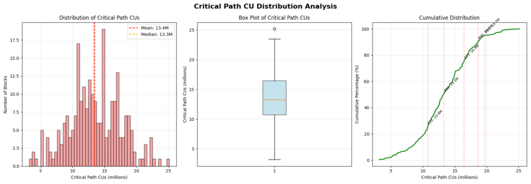
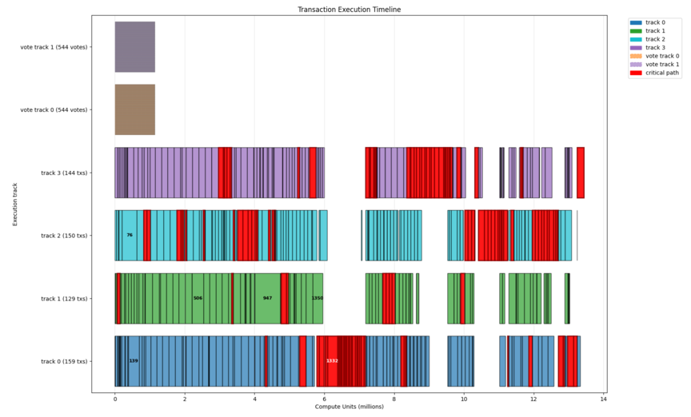
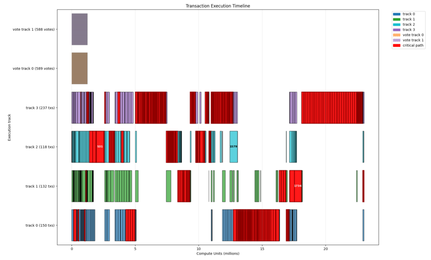
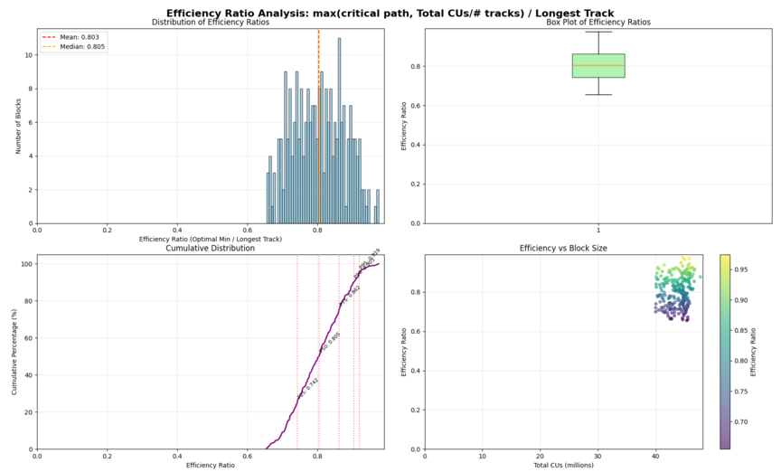
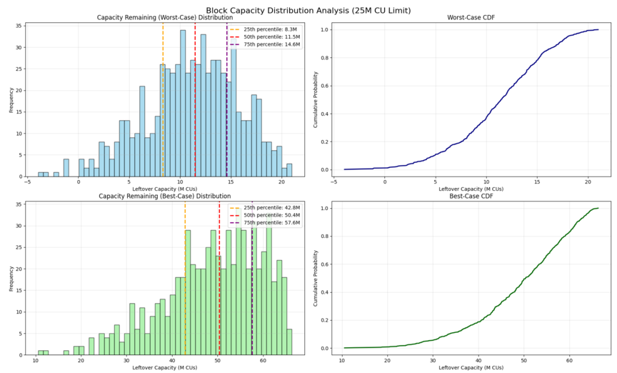

## Summary

This proposal introduces a new parallelism-aware CU tracking algorithm and serial execution constraint.
The goal is to properly bound worst case slow-replay edge cases that aren’t
covered by the existing block CU limit and per-account CU write limit. Properly bounding worst case replay time will allow us to increase global CU limit faster

## Motivation

Block limits exist to ensure that blocks can be replayed quickly by most of the cluster running a default client on reference hardware. The more accurately the protocol can bound worst case replay time, the more throughput can be allowed in the average case.

Solana currently enforces 4 block level constraints:
| Type | Current Block Limit |
|------|----------------------|
| Max Block Units | 50M
| Max Writable Account Units | 12M |
| Max Vote Units | 36M | 36M |
| Max Block Accounts Data Size Delta | 100MB | 100MB |

The Max Writable Account Unit limit which specifies the maximum number of CU's that can be consumed by transactions writing to a single account was motivated by the desire to enforce paralelism in replay. It was originally set to `12M` CU back when the Global Block CU limit was `48m = 12m*4` because the default client implementation called for execution on `4` execution threads. Unfortunately, this constraint doesn't properly bound the worst case replay behavior of a block. It is possible to construct a block with overlapping write account accesses such that all `50m` CU must be replayed serially on a single thread but no single account is written more than the `12m` CU limit.

The per-account limit doesn't only fail in these pathological cases. Data sampled from mainnet shows that among blocks with 40M+ CUs, the **median** serial workload (the critical path as described in the Terminology section below) already exceeds the 12M CU limit. Additionally, many blocks exceed the limit by significant amounts. This will only get worse as the block CU limit increases.



This proposal introduces a new block level constraint that would prevent this worst case scenario, allowing us to safely increase Global CU limits more quickly. 

## New Terminology

- **TX-DAG**: a dependency graph where each node is a transaction and each edge represents execution dependencies between transactions that contend for the same account lock. The direction of the edge is determined by the relative position of each transaction in the block order.
- **Track**: ordered list of transactions belonging to a subset of transactions in a given block. Analogous to a serial execution schedule on a single thread.
- **Vote Track**: track dedicated to only simple vote transactions.
- **Deterministic Transaction Assignment Algorithm (DTAA)**: streaming algorithm that adds each incoming transaction to the TX-DAG and assigns it to a track based on previous assignments and the dependencies encoded by the TX-DAG.
- **Critical Path**: longest CU-weighted path in a TX-DAG.
- **Makespan**: the highest CU track produced by DTAA to an entire block.
- **Serial Execution Limit**: cap on makespan.

## Detailed Design

The following table shows the current block limits and the new proposed block
limits:

| Type | Current Block Limit | Proposed Block Limit |
|------|----------------------|----------------------|
| Max Block Units | 50M | 50M |
| Max Writable Account Units | 12M | 12M |
| <span style="color:red; font-weight:bold;">NEW!</span> Max Serial Execution Units | N/A | 25M |
| Max Vote Units | 36M | 36M |
| Max Block Accounts Data Size Delta | 100MB | 100MB |

The change introduces a new Max Serial Execution Units constraint at 25M CUs.

High-level: the protocol cost tracker maintains CU counts for each execution track. *After* transactions are executed, they are sent to a cost tracker. As the cost tracker receives transactions, it processes them in block order (based on their relative positions in the block) , it deterministically assigns each executed transaction to a virtual execution track and updates that track's CU amount to account for the used CUs of the transaction, all of its parents in the `TX-DAG`, and all previous transactions assigned to the same track. This is equivalent to virtual scheduling, where each task's virtual start time depends on completion of tasks that must complete before it.

Note that this change is purely a resource constraint on which blocks are considered valid and not a prescription on how transactions should be scheduled either duing scheduling or replay. If validators are running more performant hardware they are welcome to use additional cores to schedule or replay transactions. The goal of this proposal is to ensure that blocks can replay in a timeley manner on reference hardware.

Example applications of DTAA to mainnet blocks (the red transactions are on the critical path):




side note: these are two blocks with similar total CUs, but despite this the first has a much smaller makespan. In a 4-thread, parallel execution context, the first block can be executed nearly twice as fast if using CUs as a proxy for time.

### Protocol Changes and Additions

- Number of Standard Tracks: `N = 4`
- Number of Vote Tracks: `M = 1`
- Serial Execution CU Limit: `L = 25M`
- Deterministic Transaction Assignment Algorithm:
  - `DTAA(tx_stream, N, M) -> track_cus[]`
  - `track_cus[]` contains the serial execution CUs for each track
  - `tx_stream` is a real-time transaction stream representing input during block production or verification.
    - `DTAA` processes transactions from this stream as they arrive: assigning each to an appropriate track and adding it to the `TX-DAG`.
  - Assignment to a track sets that track's total CUs to `end(tx, track)`:
    - `end(tx, track) = start(tx, track) + tx.CUs`
    - `start(tx, track) =  max(track.CUs, max_path(tx))`
    - `max_path(tx) = max(end(p, p.track) for p in TX-DAG.parents(tx))`
  - Note: `tx.CUs` is the real CUs consumed during execution, not the CU limit requested by the fee payer.
  - Simple vote transactions are assigned to the `M` vote tracks, others to the `N` standard tracks.
- A block is valid iff:
  - `max(track.CUs for track in DTAA(tx_stream, N, M)) ≤ L`
  - Vote tracks are ignored

### Requirements

- **Consensus**: the serial execution limit doesn't apply to simple vote transactions. This ensures consensus performance isn’t negatively impacted.
- **Determinism**: for a given block, all validators must assign transactions to tracks identically so they agree on the makespan calculation. Otherwise, the cluster can fork due to block validity equivocation.
- **Real-time**: the assignment algorithm must work in a real-time, streaming context so CU-tracking can occur as shreds are being received by a validator or while a leader is building a block.


A simple greedy scheduling algorithm fulfills these requirements. Pseudocode for one such algorithm is provided below. Note that optimal assignment is NP-hard so sub-optimality is unavoidable.

### Deterministic Transaction Assignment Algorithm

```
n                          // number of standard tracks
m                          // number of vote tracks
track_len[0‥n−1] = 0       // current length of each track in CUs
vote_track_len[0..m-1] = 0 // current length of each vote track in CUs
C = Map<Tx, CUs>           // longest path for each transaction
get_predecessors           // returns parents for a given tx
SERIAL_LIMIT               // limit on transaction assignment makespan

APPLY_TX_COST(t):
    // max_path(tx)
    r ← max(C[u] for u in get_predecessors(tx))

    chosen ← −1
    tracks ← track_len if is_simple_vote(t) else vote_track_len

    // Select track using the “tight-gap” heuristic:
    if min(tracks[i]) ≤ r:
      // use longest track with length ≤ r if it exists (minimize idle gap)
      candidate_tracks ← [tracks[i] for i where tracks[i] ≤ r]
      chosen ← i where tracks[i] = max(candidate_tracks[i]):
    else:
      // otherwise, fall back to classic Earliest-Finish rule
      chosen ← i where tracks[i] = min(tracks[i])

    start ← max(tracks[chosen], r)
    C[t] ← start + t.CUs
    if not is_simple_vote(t) and C[t] > SERIAL_LIMIT:
        INVALID_BLOCK

    tracks[chosen] ← C[t]
```

- `APPLY_TX_COST(tx)` must be called with transactions in the same order they appear in the block. This applies to both replayers and the leader.
- vote tracks aren't subject to the serial execution limit but we need to track them because they can still contend for the same accounts as
  transactions in the standard tracks, and be parents in the `TX-DAG` for those transactions.

### Implementation

- Block Verification (Replay): because real CUs rather than requested CUs are used for determining if constraints are satisfied, cost tracking must
  occur post-execution (i.e. `APPLY_TX_COST` must be called after `tx` is executed). Block execution during replay doesn't guarantee that transactions
  in a block will complete execution in the same order they appear in the block, so cost tracking must account for this somehow. For example, the cost
  tracker can handle re-ordering internally or a synchronization mechanism in the bank can enforce order.
- Block Production: similar post-execution requirements apply here as well; the main difference being that the position of a transaction in the block,
  in addition to the real CUs it consumes, isn't determined until post-execution when the transaction is processed by the PoH recorder. Caveat: this
  implies failure to satisfy the serial execution constraint may occur **after** a transaction has already been executed, which would waste compute
  resources. This can be mitigated partially with additional, speculative pre-execution checks (as is done currently by apply the requested CUs to the cost tracker).

### DTAA Optimality

For a block `B`, `max(critical_path(B), total_cus(B) / N)` represents a lower bound on optimal makespan `OPT`. If `lb(OPT)` is this lower bound and
`makespan` is the makespan calculated by `DTAA`, then `r = lb(OPT) / makespan` can be considered a lower bound estimate of the true optimality of `DTAA`.
The closer to 1 `r` is the more optimal DTAA is estimated to be. Empirical analysis shows that when applying `DTAA` retroactively to all mainnet blocks
with total CUs greater that 40M in a sample thousand slot range, the median `r` is `0.8`.



Applying DTAA to historical mainnet blocks also provides an upper and lower bound on how much leftover capacity there is:
- lower bound (worst-case): subtract the makespan of the block from the serial execution constraint of 25M CUs
- upper bound (best-case): sum the differences between each track's CUs and the serial execution constraint



## Alternatives Considered

- critical path constraint: a limit on the critical path of the `TX-DAG`. This does restrict long serial chains of transactions but fails as a general
  serial execution constraint because it cannot account for the degree of parallelism (e.g. number of threads).

## Impact

This proposal will likely require updates to transaction scheduling during block production, which includes MEV infrastructure like JITO. Cost tracking
will no longer be independent of order so shuffling transactions around while optimizing for profitability may impact block validity.

## Security Considerations

All validator client implementations must use the same DTAA in order to prevent equivocation on block validity. Otherwise, a partition of the network may
occur.
