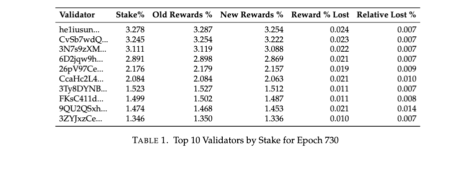

## Summary

This proposal removes base fees for voting and replaces them with a system of
vote inclusion credits paid for by inflation emissions.

The base fee serves two purposes, additional incentive for leaders to include
votes in their blocks, and protection against denial of service attacks.

The proposal aims to address this with six parts:

1. Base fees for voting will be removed entirely.

2. 25% of the issuance currently dedicated to vote credits will be dedicated to
   vote inclusion credits for leaders. This is enough to align incentives for
   leaders to include votes that they receive in a timely manner regardless
   of how much stake they hold.

3. Validators will earn rewards based on their own absolute performance instead
   of their relative performance when compared with other validators.

4. Vote transactions will no longer count towards the global CU limit in the
   block, they will have their own CU limit.

5. To address denial of service attacks via votes,  the cluster will only process
   votes from 2000 active validators. These validators will be the top 2000
   validators by stake, rotating every epoch.

6. To prevent a mod where validators delay votes until the next leader to redirect
   inclusion credit rewards, the timely vote credit window will be set to 1 for
   the third slot in each validator's sequence of blocks. It remains unchanged
   for the other slots.

## Motivation

At >2 SOL/epoch, Voting costs are by far the largest barrier to participating in
Solana consensus. But even with these large vote fees, leaders aren't properly
incentivized to include votes in a timely manner, particularly if the votes are
from large validators due to the mechanics of timely vote credits.

Unfortunately, the current system of vote fees is critical to the security of
the network. In particular, it is the only limiting factor on the number of
validators that can participate and more importantly, on the number of votes
that can be included in a block. There are a number of ways in which spinning
up many small validators with negligible stake can harm the performance of the
cluster including increasing the number of votes that must be processed, increasing
the number of validators in the turbine tree generation, and others. Reducing the
vote fees to 0 therefore requires a careful review of the security of the network
and modifications to the protocol to ensure that the network remains strong after
the change.

Since vote fees are currently the only limiting factor on the number of validators
that can vote in Solana consensus, removing vote fees must be coupled with
the addition of a different mechanism to limit the number of validators that can
vote. There are two options for this:

1. A limit on the total number of validators that can vote in the cluster.
2. A minimum stake requirement for validators.

We have opted for the first option because the minimum stake requirement required
to ensure security would be high and could potentially limit the entry of newer
validators more than the first option.

Vote fees also serve as an incentive for validators to include votes in a timely
manner, but today, vote fees are not based on stake size so due to the mechanics
of timely vote credits today there is a potential modification to the client that
would allow validators to profitably delay votes, particularly from large validators
to undermine vote credits of other validators and increase their own rewards.
To prevent this, the size of vote inclusion credits must be based on the stake
of validator that the vote transaction belongs to.

## Formal Desiderata

Formally, these are the properties we are looking for in the vote credit/vote fee
system:

1. Validator out of pocket operating cost should be minimized.

2. Validators with $< f \approx \frac{1}{3}$ of the stake should be incentivized
   to broadcast their votes to the cluster as soon as they replay a valid block.

3. Leaders with $< f \approx \frac{1}{3}$ should be incentivized to include votes
   that they receive in the next block.

4. Validator rewards should be linear in stake.

5. The total change in active stake cannot change by more than 18% from one epoch
   to the next.

6. The number of votes that can be included must be limited to prevent DOS attacks
   on the network.

7. The number of validators that can participate in consensus must be limited to
   protect Turbine operation.

In addition to these formal properties, we would also prefer a system that is simple
to understand and implement. The simpler the system is to understand, the easier
it is to verify mathematically that these properties are satisfied. And of course
simpler systems are easier to deploy and have fewer moving parts which reduces the
surface area for bugs.

Let's run through why each of these properties is important.

First, we want to minimize validator out of pocket operating cost so that more
validators can participate and so that smaller validators can compete with larger
validators more easily.

Second, validators should broadcast their votes according to the protocol in a
timely manner so that the cluster can reach consensus as fast as possible.
Third, leaders should include votes that they receive as soon as possible for the
same reason.

Fourth, validator rewards should be linear in stake so that validators don't
have an incentive to combine or split up to increase their rewards.

Fifth, the total change in active stake cannot exceed 18% from epoch to epoch
because this could result in a reversal of fast confirmations. The existing limit
of 9% total stake activations + 9% total stake deactivations must be maintained
for this security.

Sixth, the votes must be limited to cap the size of the block and prevent DOS
attacks on the network. Finally, the number of validators that can participate
in consensus must be limited to protect Turbine operation.

## Detailed Design

### Vote base fees

Vote base fees will be removed entirely.

### Absolute Vote Credits

Instead of distributing rewards based on relative performance as we do today,
each validator in the active validator set will have a maximum number of inflationary
rewards that they are eligble for. To determine this we first define the maximum
stake weighted vote credits $M$ that they can earn in an epoch where they produce
$L$ leader slots. Here $s_i$ is the validator's stake, and $S$ is the total stake.

$$M = 12 s_i \times 432000 + 4 L S$$

The first term represents the maximum voting credits $3/4$ of the TVC credits
(16), and the second term is the maximum leader inclusion credits covered in the
following section.

Their rewards in each epoch will be based on the fraction of the stake weighted
credits $c_{i}$ they actually earn relative to this maximum $M$ multiplied by the
total inflation rewards available in the epoch $I$.

$$ R_i = I \frac{c_i}{S M} $$

Any unearned sol rewards will be burned.

This represents a very slight reduction in total rewards available to validators:

### Vote Inclusion Credits

25% of issuance will be redirected from vote credits to vote inclusion credits.
These credits will be awarded to validators based on the number of votes they
include in a timely manner. Each vote inclusion credit is awarded to the leader
and is worth 1/3 of the vote credits awarded to the validator that the vote belongs
to.

For example assume that a latency 1 vote comes in from voter $v$ to be included
in leader $l$'s block. $v$ will earn 12 credits based on their stake weight, and
$l$ will earn 4 credits based on $v$'s stake weight:

$c_v := c_v + 12 s_v$

$c_l := c_l + 4 s_v$

Note that this accounting matches the $M$ derived above, if $v$ votes perfectly
and includes everyones votes (including their own):

$$c_v = 12 s_v \times 432000 + 4 L \sum_{i\in V} s_i = M$$

In order to implement this change, the vote program will track credits $c_v$ as
stake weighted totals.

### Vote transaction CU accounting

Vote transactions will no longer count towards the global CU limit in the block,
they will have their own limit of one vote per validator per block. With SIMD-0218
IVC, there is no longer any benefit to including multiple old votes within a single
block, instead only the latest vote will be used.

### Validator set size

By removing the fees for votes, we greatly reduce the barrier for entry as a voter.
This allows attackers to spin up numerous minimally staked nodes and spam votes
in an effort to slow down or DoS the cluster.

In order to address this we choose to limit the number of validators that can vote
at any given time.

These validators that are chosen to vote are the top 2000 validators by stake,
rotating every epoch.

We must abide by the maximum of 18% of the total cluster stake movement allowed
per epoch,
Priority will be given to changes in stake on validators that are already within
the top 2000 validators by stake before adjustments from inactive validators
becoming active or active validators becoming inactive.

### TVC window

On the 3rd slot in each validator's sequence of 4 blocks, the timely vote credit
grace period will only last 1 block. Rewards for landing this vote in the second
slot will be reduced by 3/8 and follow the normal TVC accounting afterwards.

The reasoning behind this change to avoid scenarios where upcoming leaders bribe
the voter to delay this vote by 1 block in order for the leader to earn more inclusion
credits.

## New Terminology

1. $V$ is the set of all validators
2. $v \in V$ is a validator
3. $s_v \in [0,1]$ is the stake fraction of validator $v$
4. $c_v \in [0,1]$ is the stake weighted vote credits of validator $v$
5. $S = \sum\limits_{v \in V} s_v$ is the total cluster stake
6. $C = \sum\limits_{v \in V} c_v$ is the total cluster stake weighted vote credits
7. $I$ is the total inflation rewards issued in an epoch
8. $T$ represents the total supply of SOL normalized to staked supply of sol
   $S =1$ so if half of the SOL is staked then $T= 2$
9. $u_v$ are vote inclusion credits for each validator

## Proofs that the proposed system satisfies the desiderata:

It's clear that maximum validator set size satisfies properties 6 and 7 by
definition. And that capping entry and exit to 18% satisfies 5, also by
definition. 1. is satisfied by the removal of vote costs and is the point of the
proposal. Properties 2,3, and 4 are incentive compatibility properties where we
must spend our time.

First we should verify that, upon receiving a vote, the leader should include it
in the next block. Each leader $i$ has reward function.
$$
R_i(s_1,\dots,s_n,c_1,\dots,c_n, u_1,\dots,u_n) = I s_i \frac{c_i}{M} + Iu_i -
  [\sum_{j=1}^n I s_j \frac{c_j}{M} +  u_i]\cdot \frac{s_i}{T}
$$

The leader, having received a vote from validator $j$ has two choices: include
the vote and receive a vote inclusion credit of
$$ \frac{1}{3}I s_j \frac{c_j}{M} $$

Or delay the vote and prevent the validator from earning vote credits. If he
delays the vote he receives, due to the reduction in inflation:
$$ \frac{s_i}{T} I s_j \frac{c_j}{M} $$

as long as the leader $i$ has $< f \approx \frac{1}{3}$ of the stake, we have :
$$ \frac{s_i}{T} I s_j \frac{c_j}{M}
  < \frac{1/3}{T} I s_j \frac{c_j}{M}
  < \frac{1}{3} I s_j \frac{c_j}{M} $$

So the leader will include the vote $\blacksquare$

Next we must verify that the sender of the vote is incentivized to broadcast their
vote as soon as possible. There is a separate issue here of vote lagging where
validators may delay votes to make sure they don't get locked off of the correct
fork. This is a separate issue with tower and is not addressed by this proposal.
But we can verify that the sender of the vote is not incentivized to delay their
vote to give the vote inclusion credit to their own validator when they are the
next leader.

With a timely vote credit window of 2 blocks, the only slot that has a TVC window
with 2 different leaders in it is the 3rd slot. If the voter is voting on slot 3
of leader $j$ and is the next leader in the rotation then the risk is that this
leader might want to delay their vote to give the vote inclusion credit to themselves.

This is the reason we need to adjust the TVC window for second to last slot in each
leader's sequence of 4 blocks. It may seem that reducing the vote credit on leader
rotation by 25% would be enough, after all the rewards for the delayed vote in addition
to the vote inclusion credit is equal to the rewards for the vote in the first slot.
But there is a small inflation term to account for. By delaying the vote, the leader
reduces the induced inflation by $25\%$ so it is still profitable to delay the vote.
To solve for what the reduction must be we need to solve the following equation:

$$
\frac{3}{4}\ =\alpha\ +\ \frac{\left(1-\alpha\right)}{3}
$$

$$\frac{3}{4\ }-\frac{1}{3}\ =\ \alpha\ -\ \frac{\alpha}{3}$$

$$\frac{3}{4}-\frac{1}{3}\ =\ \frac{2\alpha}{3}$$

$$ \alpha = \frac{5}{8} $$

Then even with 100% of the network staked and a leader with 1/3 of the stake would
still be indifferent between voting right away in the 4th slot of leader $j$ and
delaying their vote 1 slot to give the vote inclusion credit to themselves. $\blacksquare$

Finally now that we have verified that leaders and voters are incentivized to send
and include votes in a timely manner, we need to verify that the total rewards are
linear in stake. That is, we want to show that:

$$
R_i(s_1,\dots,s_n,c_1,\dots,c_n, u_1,\dots,u_n) = a s_i + b
$$

for some $a$. Since we have already argued that votes will be sent and included
in a timely manner, regardless of the stakes of the voters and the leaders, it
is enough to show that each term is linear in stake.

The first term $I s_i \frac{c_i}{M}$ and the last term
$- [\sum_{j=1}^n I s_j \frac{c_j}{M} +  u_i]\cdot \frac{s_i}{T}$ are linear by
inspection. For the $Iu_i$ term we must argue that vote inclusion credits are
linear in stake. Since votes are sent and included in a timely manner, each block
earns vote credits proportional to the total stake $S$, but the number of blocks
that each validator earns is proportional to the stake due to the way we calculate
leader rotations so $u_i$ is linear in stake. $\blacksquare$

## Alternatives Considered

This proposal was derived from the desiderata directly. Many of these details are
the unique way to achieve incentive compatibility with the minimum changes necessary.
We did consider minimum stake requirements as an alternative to maximum validator
set size but this would have limited entry of new validators more than what
we are proposing.

## Impact

This proposal reduces vote costs, benefiting small validators and lowering
operating expenses for the entire validator set. It also introduces separate
accounting for vote transactions so there is no risk that a validator might not
include votes in order to stuff the block with other transactions. It invalidates
a number of pernicious vote mods which are currently profitable but threaten
the security of the network and the correctness of consensus.

## Security Considerations

This represents a major change to the way rewards are distributed and should be
carefully reviewed. There are a number of potential DOS attacks that are currently
impossible due to fixed vote fees that should all be re-evaluated under this
new proposal.

## Drawbacks *(Optional)*

This proposal would remove vote fees which are a regressive policy where small
validators transfer fees to large validators. This change would obviously
slightly disadvantage large validators. It would also increase net inflation
because the half of vote fees which are now burned would no longer be burned.

## Backwards Compatibility

This feature is not backwards compatible.
